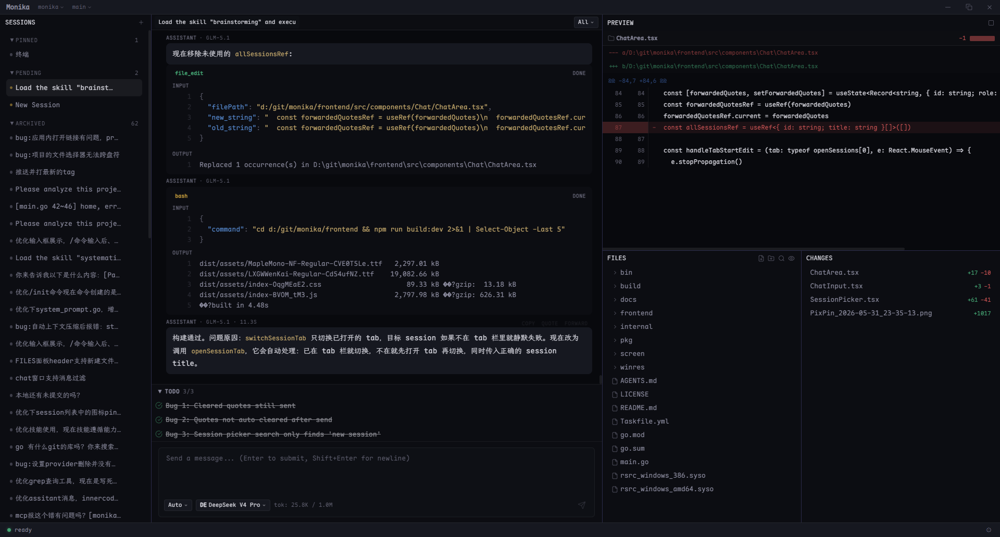

<p align="center">
  <strong>Monika</strong>
</p>

<p align="center">
  Open-source AI coding editor — gives an AI agent first-class access to code, files, and tools through a multi-panel GUI.
</p>

<p align="center">
  <a href="README.zh.md">中文</a>
</p>

<p align="center">
  <a href="https://github.com/RedTeaLab/monika/actions"></a>
  <a href="https://github.com/RedTeaLab/monika/blob/main/LICENSE"></a>
  <a href="https://go.dev"></a>
  <a href="https://react.dev"></a>
  <a href="https://wails.io"></a>
</p>



---

## What is Monika?

Monika is a desktop AI coding editor built on [Wails v3](https://wails.io). A Go backend paired with a React frontend, it lets an AI agent read and write files, search code, and run commands through a multi-panel GUI — not just a chat window, but a complete coding environment.

**Provider-agnostic.** Any OpenAI-compatible API endpoint works. Model context and output limits are automatically fetched from [models.dev](https://models.dev).

## Quick Start

Download from [Releases](https://github.com/RedTeaLab/monika/releases), or build from source:

```powershell
# Prerequisites: Go 1.25+, Node.js 18+, Wails v3 CLI
go install github.com/wailsapp/wails/v3/cmd/wails3@latest

git clone https://github.com/RedTeaLab/monika.git
cd monika
cd frontend && npm install && cd ..

# Dev mode (hot reload)
wails3 dev

# Build standalone
cd frontend && npm run build && cd ..
go build .
```

### Configure Provider

First run will prompt for configuration, or create `~/.monika/config.yaml` manually:

```yaml
model_provider: deepseek
model: deepseek-chat
model_providers:
  deepseek:
    name: deepseek
    base_url: https://api.deepseek.com
    api_key: sk-xxx
```

## Features

### Multi-Panel GUI

Session list, chat area, file tree with CodeMirror 6 editor, console, and status bar — all in one window. Three layout modes (chat, split, files-only) with a draggable divider.

### Multi-Tab Sessions

Up to 8 concurrent session tabs with independent message caching. Sessions are automatically persisted as JSON and restored on next startup.

### Streaming Agent Loop

Real-time text deltas, tool execution cards, and token usage tracking. The agent handles context compaction automatically — when the conversation exceeds the model limit, it summarizes older messages with a separate LLM call.

### Tool Calling

The agent can manipulate your project directly:

| Tool | Description |
|------|-------------|
| `file_read` | Read files with precision (offset/limit) |
| `file_write` | Create or overwrite files |
| `file_edit` | Exact string replacement |
| `file_list` | List directory contents |
| `glob` | Glob pattern file discovery |
| `grep` | Regex search across files |
| `bash` | Execute shell commands (cross-platform) |
| `lsp` | Language Server Protocol — diagnostics, go-to-definition, references, rename, etc. ([docs](docs/lsp.md)) |

The agent can manipulate your project directly:

| Tool | Description |
|------|-------------|
| `file_read` | Read files with precision (offset/limit) |
| `file_write` | Create or overwrite files |
| `file_edit` | Exact string replacement |
| `file_list` | List directory contents |
| `glob` | Glob pattern file discovery |
| `grep` | Regex search across files |
| `bash` | Execute shell commands (cross-platform) |

### Git Integration

File change tracking, diff viewing, local/remote branch listing, branch creation and switching, worktree-aware branch management.

### Skills & MCP

- **Skills** — Supports the [SKILL.md](https://github.com) standard, auto-discovers and loads skills from GitHub repos
- **MCP** — Model Context Protocol, extends agent capabilities (databases, browser, web search, etc.) via stdio JSON-RPC transport

### Concurrent Sub-Agents

Built-in TaskRunner dispatches up to 4 concurrent child agents via semaphore, ideal for large-scale code search and multi-file modification tasks.

### Permission Safety

Every tool call goes through a complete permission pipeline — hard rules and security model double validation to prevent unauthorized operations.

## Supported Providers

Any OpenAI-compatible endpoint works:

| Provider | Engine ID | Default Model |
|----------|-----------|---------------|
| DeepSeek | `deepseek` | `deepseek-chat` |
| OpenAI | `openai` | `gpt-4o` |
| Anthropic Claude | via OpenAI-compatible API | `claude-sonnet-4-5` |
| Google Gemini | via OpenAI-compatible API | `gemini-2.0-flash` |
| Custom | any OpenAI-compatible endpoint | — |

## Architecture

```
monika/
├── main.go                # Wails entry point, embeds frontend, wires all services
├── frontend/              # React 18 + TypeScript + Tailwind CSS v4
│   └── src/
│       ├── App.tsx        # Root component, dockview panel layout
│       ├── store/         # Single Zustand store, all app state
│       └── components/    # UI components
├── internal/
│   ├── agent/             # Agent loop, streaming, compaction, multi-agent dispatch
│   ├── api/               # Wails services: App, SessionManager, FileService, EventBus
│   ├── bootstrap/         # Provider initialization
│   ├── config/            # YAML/JSON config loader (~/.monika/ + .monika/)
│   ├── engines/           # Provider adapters + Skill + MCP engines
│   ├── permission/        # Tool permission pipeline
│   └── tool/              # Tool interface + registry + builtin tools
└── pkg/
    ├── engine/            # Public Engine interface + registry
    ├── openai/            # OpenAI-compatible SSE streaming client
    ├── modelsdev/         # models.dev catalog fetcher
    └── gitutil/           # Git utility functions
```

### Engine Pattern

Every engine implements the `pkg/engine.Engine` interface and self-registers via `init()` + `engine.Register()`. Provider engines additionally implement `StreamChat` and `ListModels`. The `wire_api` field in config determines which engine adapter to use.

### Tool Pattern

Tools implement `Name()` / `Description()` / `Parameters()` / `Execute()` and are composed via combinable registration functions (`RegisterDefaults`, `RegisterTasks`, `RegisterSpawnAgent`, etc.).

## Development

```powershell
# Run tests
go test ./...

# Static analysis
go vet ./...

# Format
gofmt -w .

# Build frontend
cd frontend && npm run build

# Regenerate Wails bindings (after changing Go API types)
wails3 generate bindings -f "..." -ts

# Tidy dependencies
go mod tidy
```

## Contributing

Issues and pull requests are welcome. See [AGENTS.md](AGENTS.md) for development details.

## License

[MIT License](LICENSE) © 2025 RedTeaLab

Third-party components:

| Component | License |
|-----------|---------|
| [Wails](https://wails.io) | MIT |
| [CodeMirror](https://codemirror.net) | MIT |
| [dockview](https://dockview.dev) | MIT |
| [React](https://react.dev) | MIT |
| [zustand](https://zustand.docs.pmnd.rs) | MIT |
| [LXGW WenKai](https://github.com/lxgw/LxgwWenKai) | SIL OFL 1.1 |
| [Maple Mono NF](https://github.com/subframe7536/Maple-font) | SIL OFL 1.1 |
