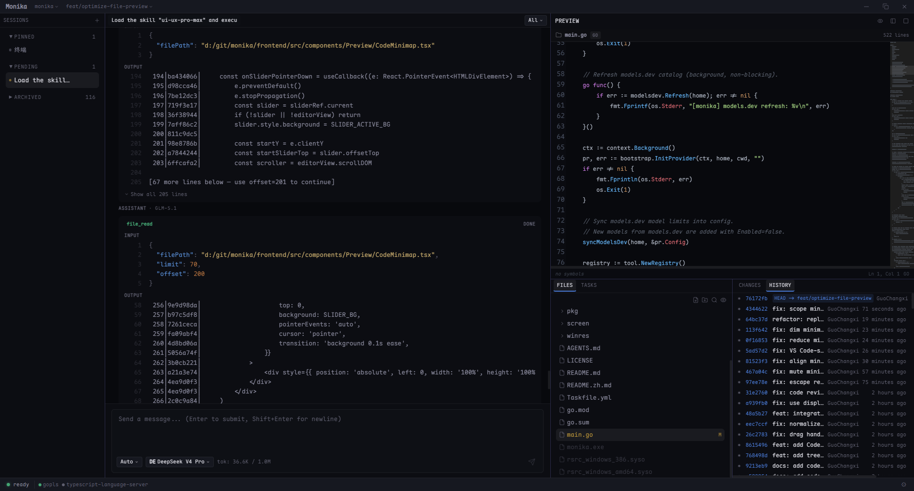

<p align="center">
  <strong>Monika</strong>
</p>

<p align="center">
  开源 AI 编程编辑器 — 让 AI Agent 拥有对代码、文件和工具的一站式访问。
</p>

<p align="center">
  <a href="README.md">English</a>
</p>

<p align="center">
  <a href="https://github.com/RedTeaLab/monika/actions"></a>
  <a href="https://github.com/RedTeaLab/monika/blob/main/LICENSE"></a>
  <a href="https://go.dev"></a>
  <a href="https://react.dev"></a>
  <a href="https://wails.io"></a>
</p>



---

## Monika 是什么？

Monika 是一个基于 [Wails v3](https://wails.io) 构建的桌面端 AI 编程编辑器。Go 后端 + React 前端，通过多面板 GUI 让 AI Agent 直接读写文件、搜索代码、执行命令——不只是聊天窗口，而是一个完整的编程环境。

**不绑定任何模型提供商。** 只要兼容 OpenAI API，就能接入。模型上下文长度和输出限制自动从 [models.dev](https://models.dev) 获取。

### 为什么叫 "Monika"？

名字来自《心跳文学部》（Doki Doki Literature Club）。游戏中的 Monika 是唯一一个觉醒了自我意识的角色——她意识到自己身处程序之中，能够读取文件、改写周围的世界。

这正是我们对 AI 编程 Agent 的期望：不只是待在聊天框里回答问题，而是感知整个项目——文件树、代码、诊断信息——并直接对其进行操作。一个打破对话与代码库之间"第四面墙"的 Agent，穿越边界，亲手重塑你正在构建的东西。

我们相信下一代 IDE 将以 AI 为核心驱动，而非作为侧边栏的附加功能。Monika 是我们迈向这一愿景的尝试。


## 安装

从 [Releases](https://github.com/RedTeaLab/monika/releases) 下载对应平台的安装包，或从源码构建：

### 前置依赖

| 平台 | 依赖 |
|------|------|
| **macOS** | Go 1.25+, Node.js 18+, Xcode Command Line Tools |
| **Windows** | Go 1.25+, Node.js 18+, WebView2 |

### 安装 Wails v3 CLI

```bash
# 安装与项目匹配的 CLI 版本 (v3.0.0-alpha.78)
go install github.com/wailsapp/wails/v3/cmd/wails3@v3.0.0-alpha.78
```

### 从源码构建

```bash
git clone https://github.com/RedTeaLab/monika.git
cd monika

# 1. 安装前端依赖
cd frontend && npm install && cd ..

# 2. 生成 Wails 绑定 (Go 类型 → TypeScript)
wails3 generate bindings -ts
node -e "require('fs').copyFileSync('build/barrel_index.ts','frontend/bindings/monika/index.ts')"

# 3a. 开发模式 (热重载)
wails3 dev

# 3b. 或构建独立可执行文件
cd frontend && npm run build && cd ..
go build -o monika .
# macOS: ./monika
# Windows: .\monika.exe
```

### 配置模型提供商

首次运行会引导配置，或手动创建 `~/.monika/config.yaml`：

```yaml
model_provider: deepseek
model: deepseek-chat
model_providers:
  deepseek:
    name: deepseek
    base_url: https://api.deepseek.com
    api_key: sk-xxx
```

## 功能一览

### 多面板 GUI

会话列表、聊天区域、带 CodeMirror 6 的文件树编辑器、控制台、状态栏——一个窗口搞定全部。支持聊天、分屏（聊天 + 文件）、纯文件三种布局模式，可拖拽分隔条自由调节。

### 多标签会话

最多 8 个并发会话标签页，每个标签独立消息缓存。会话自动持久化为 JSON 文件，下次打开即恢复。

### 流式 Agent 循环

实时文本流、工具调用卡片、Token 用量追踪。Agent 自动处理上下文压缩，当对话超出模型限制时用单独的 LLM 调用摘要历史消息。

### 工具调用

Agent 可以直接操作你的项目：

| 工具 | 功能 |
|------|------|
| `file_read` | 读取文件（带 offset/limit 精确读取） |
| `file_write` | 创建或覆盖文件 |
| `file_edit` | 精确字符串替换 |
| `file_list` | 列出目录内容 |
| `glob` | Glob 模式文件查找 |
| `grep` | 正则搜索文件内容 |
| `bash` | 执行 Shell 命令（跨平台） |
| `lsp` | Language Server Protocol — 诊断、跳转定义、查找引用、重命名等 ([文档](docs/lsp.zh.md)) |

### Git 集成

文件变更追踪、Diff 查看、本地/远程分支列表、创建和切换分支、Worktree 感知的分支管理。

### Skills & MCP

- **Skills** — 支持 [SKILL.md](https://github.com) 标准，从 GitHub 仓库自动发现和加载技能
- **MCP** — Model Context Protocol，通过 stdio JSON-RPC 传输协议扩展 Agent 能力（数据库、浏览器、Web 搜索等）

### 子 Agent 并发

内置 TaskRunner 通过信号量调度最多 4 个并发子 Agent，适合大规模代码搜索、多文件修改等复杂任务。

### 权限安全

工具调用经过完整的权限管线检查——硬性规则 + 安全模型双重验证，确保 Agent 不会越权操作。

## 支持的模型提供商

任何兼容 OpenAI API 的端点都能接入：

| 提供商 | Engine ID | 默认模型 |
|--------|-----------|----------|
| DeepSeek | `deepseek` | `deepseek-chat` |
| OpenAI | `openai` | `gpt-4o` |
| Anthropic Claude | via OpenAI 兼容 API | `claude-sonnet-4-5` |
| Google Gemini | via OpenAI 兼容 API | `gemini-2.0-flash` |
| 自定义 | 任意 OpenAI 兼容端点 | — |

## 架构

```
monika/
├── main.go                # Wails 入口，嵌入前端，连接所有服务
├── frontend/              # React 18 + TypeScript + Tailwind CSS v4
│   └── src/
│       ├── App.tsx        # 根组件，dockview 面板布局
│       ├── store/         # 单一 Zustand Store，全部应用状态
│       └── components/    # UI 组件
├── internal/
│   ├── agent/             # Agent 循环、流式传输、上下文压缩、多 Agent 调度
│   ├── api/               # Wails 服务: App, SessionManager, FileService, EventBus
│   ├── bootstrap/         # Provider 初始化
│   ├── config/            # YAML/JSON 配置加载 (~/.monika/ + .monika/)
│   ├── engines/           # Provider 适配器 + Skill + MCP 引擎
│   ├── permission/        # 工具权限管线
│   └── tool/              # 工具接口 + 注册表 + 内置工具
└── pkg/
    ├── engine/            # 公共 Engine 接口 + 注册表
    ├── openai/            # OpenAI 兼容 SSE 流式客户端
    ├── modelsdev/         # models.dev 模型目录获取
    └── gitutil/           # Git 工具函数
```

### Engine 模式

每个引擎实现 `pkg/engine.Engine` 接口，通过 `init()` + `engine.Register()` 自注册。Provider 引擎额外实现 `StreamChat` 和 `ListModels`。配置中的 `wire_api` 字段决定使用哪个引擎适配器。

### Tool 模式

工具实现 `Name()` / `Description()` / `Parameters()` / `Execute()` 接口，通过可组合的注册函数（`RegisterDefaults`, `RegisterTasks`, `RegisterSpawnAgent` 等）灵活组合。

## 开发

```bash
# 测试
go test ./...

# 静态分析
go vet ./...

# 格式化
gofmt -w .

# 前端构建
cd frontend && npm run build

# 重新生成 Wails 绑定 (修改 Go API 类型后)
wails3 generate bindings -ts
node -e "require('fs').copyFileSync('build/barrel_index.ts','frontend/bindings/monika/index.ts')"

# 依赖整理
go mod tidy
```

## 贡献

欢迎提交 Issue 和 Pull Request。开发细节请参考 [AGENTS.md](AGENTS.md)。

## License

[MIT License](LICENSE) © 2025 RedTeaLab

第三方组件：

| 组件 | 协议 |
|------|------|
| [Wails](https://wails.io) | MIT |
| [CodeMirror](https://codemirror.net) | MIT |
| [dockview](https://dockview.dev) | MIT |
| [React](https://react.dev) | MIT |
| [zustand](https://zustand.docs.pmnd.rs) | MIT |
| [LXGW WenKai](https://github.com/lxgw/LxgwWenKai) | SIL OFL 1.1 |
| [Maple Mono NF](https://github.com/subframe7536/Maple-font) | SIL OFL 1.1 |

## 致谢

Monika 站在巨人的肩膀上。以下项目塑造了我们的设计理念，其中许多功能直接受到它们的启发：

- **[VS Code](https://github.com/microsoft/vscode)** — 定义了现代开发体验的编辑器。Monika 的代码缩略图渲染直接参考了其 Canvas 实现。
- **[oh-my-pi](https://github.com/can1357/oh-my-pi)** — 极其出色的终端 AI Agent，以深度 LSP 集成、子 Agent 编排和开箱即用的哲学，向我们展示了 Agent 界面的真正潜力。
- **[OpenCode](https://github.com/sst/opencode)** — 为终端而生的开源 AI 编程 Agent。其简洁的架构和 Provider 无关的设计理念深刻影响了我们的方案。

感谢这些项目及其作者。开源因传承而伟大——我们很荣幸能成为这一传统的一部分。
